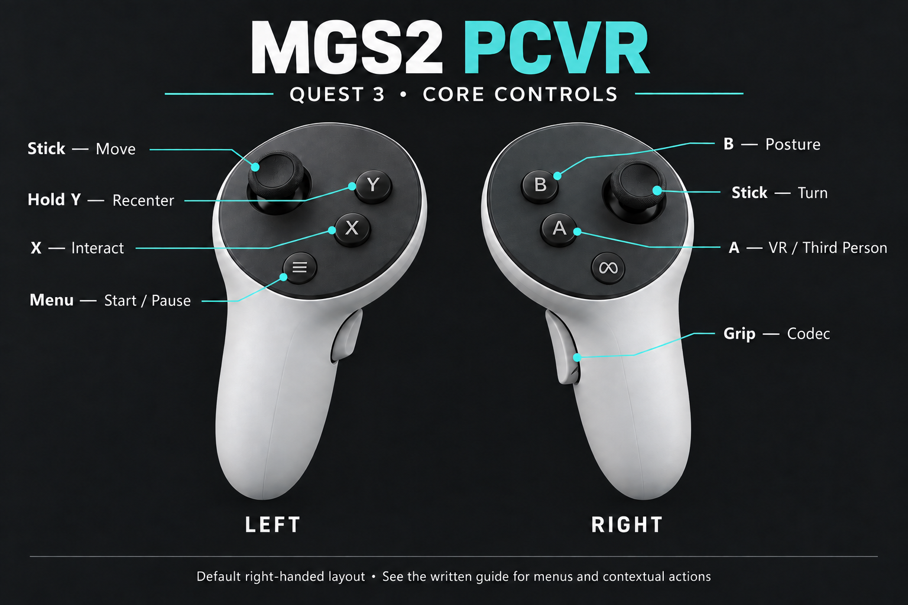

# MGS2 PCVR — v0.3.5

Play **METAL GEAR SOLID 2: Sons of Liberty — Master Collection Version** in PC VR, with headset tracking and motion-controller controls.

**Supports PS VR2 / SteamVR and Meta Quest 3 PC VR.** Earlier releases were tested on those setups; this rebuilt release still needs headset validation. This unofficial mod uses **OpenXR** and **AER (Alternate Eye Rendering)**. It runs on a Windows gaming PC; it is not a standalone Quest app.

**[Download v0.3.5](https://github.com/Shiffo0/MGS2-PCVR/releases/tag/v0.3.5)** · [Installation](#installation) · [Controls](#controls) · [Known limitations](#known-limitations) · [Report a problem](https://github.com/Shiffo0/MGS2-PCVR/issues)

The **Tanker chapter with Snake** is the focus of this beta. Switch between VR and Third Person as needed, and check your wrist for radar and LIFE information. **Plant / Raiden support is still in development** and is not ready for a complete VR playthrough.

## New in v0.3.5

Game Over controller recovery, HUD/cutscene placement fixes, held coolant spraying, standing coolant/microphone movement and arm positioning, shared USP/SOCOM reload hooks, and improved rigid hand attachment selection. Development measurements are excluded from the player build and removed from the corresponding mod-source paths where separate from gameplay. Limited startup/error logging remains.

See [the release notes](RELEASE_NOTES.md) for changes since v0.3.4 and validation limits. This source-cleaned rebuild is **1007DD0B**; it has not replaced the maintainer's installed playtest build.

## Requirements

- Your own Steam copy of **MGS2 — Master Collection Version** on Windows.
- A Windows gaming PC capable of running the game and PC VR.
- **PS VR2 with Sense controllers and a supported PC connection**, or **Meta Quest 3 with Touch Plus controllers**, connected to PC VR.
- An active OpenXR runtime for your PC VR setup.

Other headsets and game versions have not been validated. Device support does not imply a full regression test of this exact release.

The retained v0.3.3 fix addresses the SteamVR gameplay “Waiting” problem caused by graphics-device initialization. It also retains unlimited sessions and recovery when the game changes rendering resolution.

## Installation

1. Launch the unmodified game once, then close it.
2. Connect your headset and start your PC VR software. For **PS VR2**, use **SteamVR** and select it under **SteamVR Settings → OpenXR**. For **Quest Link / Air Link**, select Meta as active under **Meta Quest Link → Settings → General → OpenXR Runtime**. Close the game before switching runtimes.
3. Download **`MGS2-PCVR-v0.3.5-1007DD0B.zip`** from the [release page](https://github.com/Shiffo0/MGS2-PCVR/releases/tag/v0.3.5). Choose the mod ZIP under **Assets**, not GitHub's automatic **Source code** downloads.
4. In Steam, right-click the game → **Manage → Browse local files**. Extract the ZIP into the folder containing **`METAL GEAR SOLID2.exe`**, keeping its folder structure.
5. Back up any existing files before replacing them. If other mods already provide `winmm.dll` or `openxr_loader.dll`, start with a clean mod setup; compatibility with other mods has not been validated.
6. Launch the game through Steam with your headset connected. The control table below uses **Quest button names**; for PS VR2, check the corresponding actions in SteamVR controller bindings.
7. Start with **Tanker**, and check the controls and limitations below.

### Updating or uninstalling

Close the game before changing files. Back up your mod files and settings before updating. To disable the mod, move `dg_hook.asi` out of the game folder. To uninstall it, remove the files supplied in the ZIP and restore your backups. Keep shared loaders if another mod uses them. The mod package does not replace your saves.

## Controls

Controls below use **Quest button names** and the **default right-handed layout**. PS VR2 button assignments can differ through SteamVR; check its controller bindings for the corresponding actions. To open the Codec, bring your right hand near your right ear before pressing the grip.

| Input | Action |
| --- | --- |
| Left stick | Move; up/down on ladders when engaged |
| Right stick | Turn; camera zoom when using the photo camera |
| Right **A** | Switch VR / Third Person during gameplay |
| Right **B** | Posture / crouch action |
| Left **X** | Interact: doors, handles and contextual actions; hold where the interaction requires it |
| Hold left **Y** | Recenter your view |
| Left **Menu** | Start / pause |
| Right trigger | Weapon action; pistols follow their aim / fire / release behavior |
| Left trigger | Melee / contextual choke action |
| Left grip | Contextual grab / hold |
| Right grip, with the right hand near the right ear | Codec; move the hand into position before pressing the grip |
| Right trigger + **B** | Unarmed: save both wrist alignments; armed: calibrate weapon aim |
| Right stick click | Weapon selection radial |
| Left stick click | Item selection radial |

**Radial selection:** start with the stick centered and triggers released. Hold the relevant stick click, move that stick toward the entry, and press the **same controller's trigger** to confirm. Releasing the stick click while an entry is highlighted also selects it. The opposite trigger cancels. Release the controls and return the stick to center before opening another selection. Release the selection trigger before using the weapon.

**Menus:** use the right stick to navigate, **A or right trigger** to confirm, and **B** to go back. Gameplay actions depend on context and are not all available in menus or scripted scenes.

**Mod settings (keyboard):** with the game focused during gameplay, press **Home** to open or close the settings panel. Use **Up/Down** to select View (stereo/mono), VR Pistol Reload or M9 Slide; use **Enter** or **Left/Right** to toggle an available option. After closing, release the buttons and center both sticks to resume control.

**Photo camera:** begin at minimum zoom and let it settle briefly before zooming. Its zoom is controlled with the right stick. Security-camera traversal remains a separate limitation.

## Persistent hand alignment

Automatic defaults position the hands from controller tracking. While **unarmed**, hold both hands in a comfortable neutral pose with both controllers tracked, then press **right trigger + B** to save a one-time wrist-alignment override for both hands. A later deliberate calibration replaces it.

The override persists across game restarts in `dg_hand_calibration.bin` beside the game executable. Weapon changes, animations, first/third-person switches, new levels, cutscenes and tracking loss preserve the calibration/default. Native animations can temporarily take control of the hands, and reach limits still apply.

Keep this file when updating. To restore defaults, close the game, rename `dg_hand_calibration.bin`, then restart.

## Known limitations

- **First-person locker entry:** the problem reported in v0.3.4 has not been verified as fixed; use Third Person if affected.

- **Security-camera sections:** use **Third Person** to get past cameras, then switch back to VR with **A**.
- **Hanging and moving while hanging:** still experimental; use **Third Person** for these actions.
- **Grenades:** not supported in VR yet.
- **Plant / Raiden:** incomplete. Experimental weapon features are included, but a full VR campaign is not supported yet.
- **Visual Stereo bugs:** from certain angles stereo image produces a double image.
- **Arm placement:** native animations and reach limits can affect the visible pose. Recenter with Y or switch perspective if needed. Saved wrist alignment persists; it does not guarantee correct placement in every animation. (persistent hand alignment seems to fix this Right Trigger + A)
- **Session length:** the included configuration uses `seconds=0` for no automatic cutoff; update older settings explicitly.

## AER and performance

**AER (Alternate Eye Rendering)** renders the left and right eye on alternating game frames. At 60 game frames per second, each eye receives roughly **30 fresh images per second**. Increasing the headset refresh rate does not increase that number.

You may notice ghosting or judder during motion. Keep the game's frame rate stable and use settings your PC can sustain. Comfort varies between players.

## What's next?

Future work focuses on **Raiden and the Plant chapter**, including further coolant and SOCOM validation, scope and sniper-rifle support, further Stinger work, and Nikita support. Hanging and grenades also need more work. There is no release date for complete Raiden support yet.

## Troubleshooting and feedback

- **No VR image:** check your PC VR connection, active OpenXR runtime and installation folder. The mod files must sit beside the game executable. Make sure the `.on` files have not gained an extra `.txt` extension.
- **View offset or facing the wrong way:** face forward and hold **Y** to recenter.
- **Stuck at a camera or hanging section:** press **A** to switch to Third Person.
- **VR stops after about an hour:** install v0.3.5, close the game and set `seconds=0` in `dg_hook.on`.
- **Problems with other mods:** try this beta on its own before reporting the problem.

[Report a problem](https://github.com/Shiffo0/MGS2-PCVR/issues) with your mod version, game version, headset, PC VR software, GPU, chapter/location and steps to reproduce it. Mention whether it happens in VR, Third Person or both. Review logs before sharing them and avoid uploading personal data or game files.

## Credits and license

Created by **Shiffo0**. This is an unofficial fan project, not affiliated with or endorsed by Konami, Sony or Meta. The game is sold separately.

The mod's original code and documentation are available under the **[MIT License](LICENSE)**. This license covers the contributors' own work, not the game, its assets or trademarks. Third-party components retain their own licenses; notices are included in the download.

- [Ultimate ASI Loader](https://github.com/ThirteenAG/Ultimate-ASI-Loader) by ThirteenAG.
- [OpenXR SDK / loader](https://github.com/KhronosGroup/OpenXR-SDK) by Khronos and contributors.

For contributors: [mod source and build instructions](https://github.com/Shiffo0/MGS2-PCVR/tree/main/src).

The controller illustration is AI-generated. Use the written control table for contextual actions.
